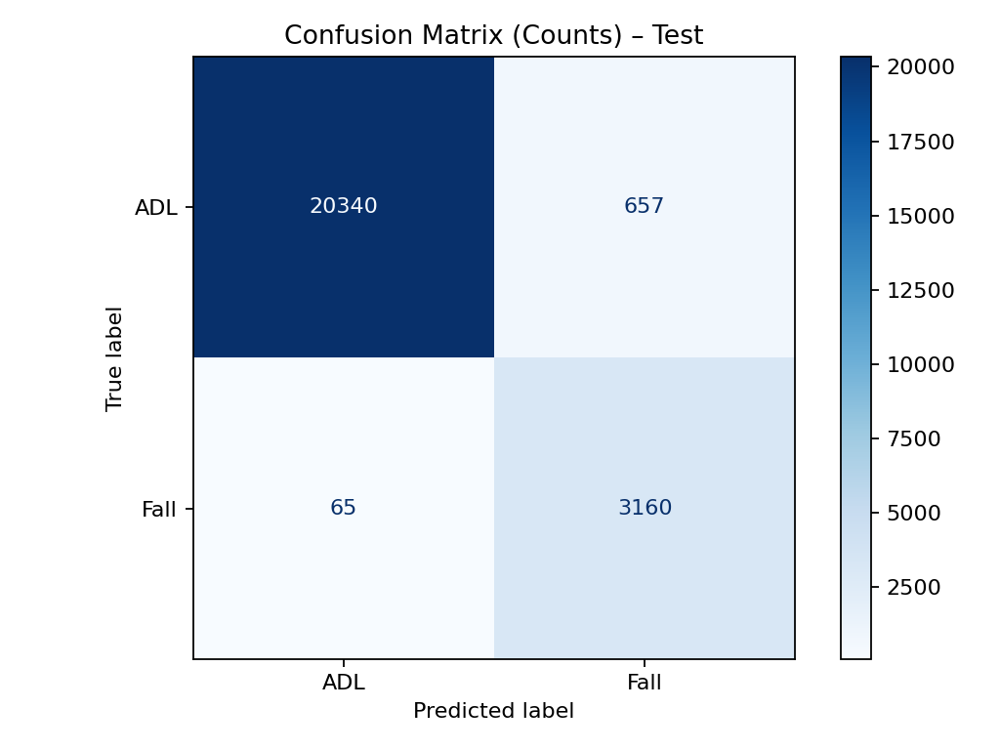
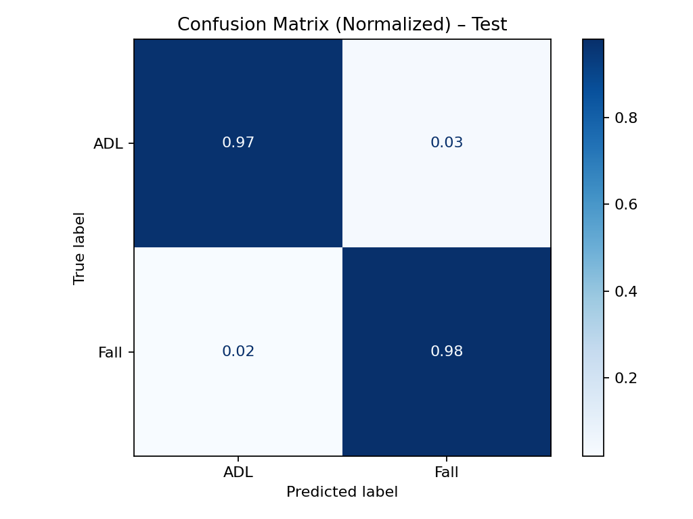
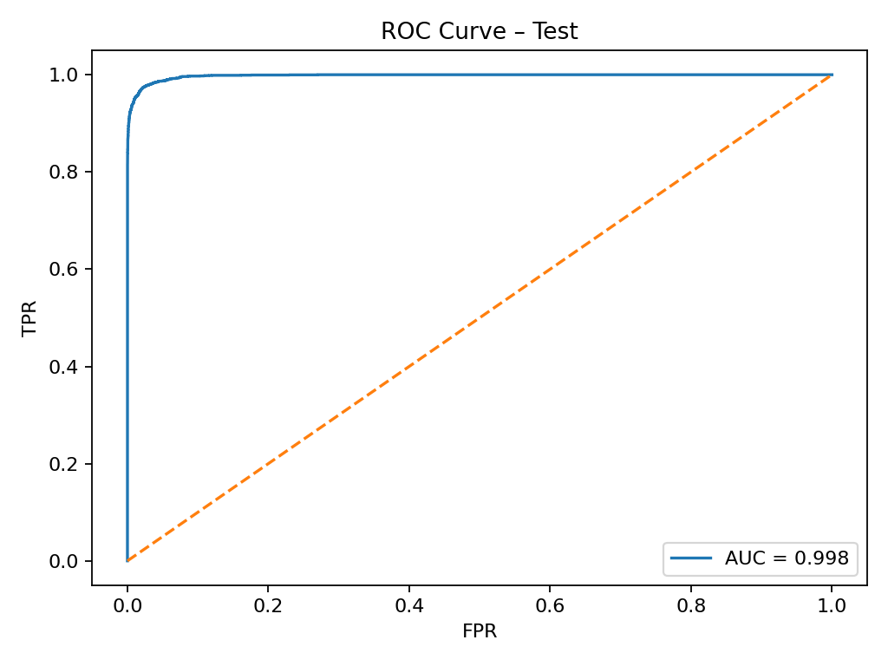
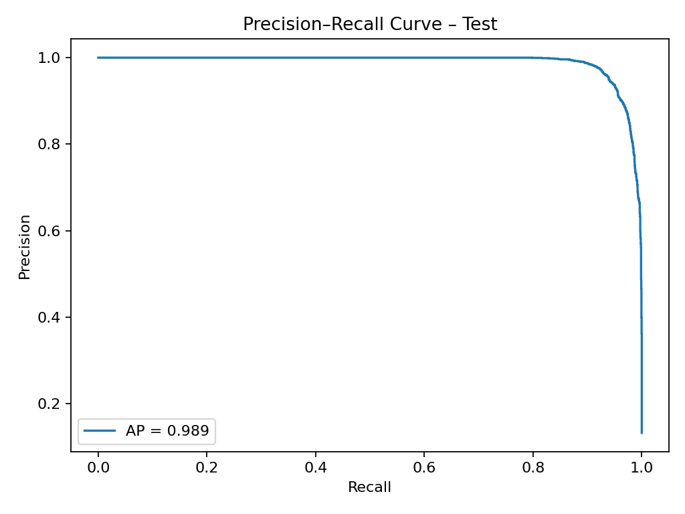
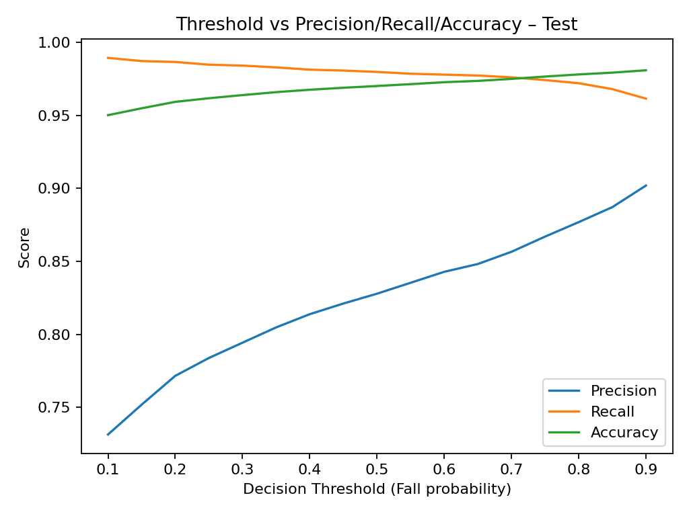

Elderly Fall Detection using AI (SisFall Dataset)
Overview

This project detects falls in elderly people using the SisFall dataset and a deep learning model.
When a fall is detected in real-time from wearable IMU data (e.g., MPU6050 on Arduino/ESP32), the system sends an SMS alert to caregivers or family members.

1) Uses SisFall dataset (200 Hz accelerometer & gyroscope data)
2) Trains a 1D-CNN + GRU model to classify fall vs. daily activity
3) Works with real-time IMU streaming via serial
4) SMS notifications powered by Twilio

### Test Set Results (Subject-wise Split)

| Confusion (counts) | Confusion (normalized) |
|---|---|
|  |  |

| ROC Curve | Precision–Recall |
|---|---|
|  |  |

**Key numbers** (from `eval_test.py`):  
- Accuracy: **0.970**  
- Falls — Precision: **0.828**, Recall: **0.980**, F1: **0.897**  
- Confusion: `[[20340, 657], [65, 3160]]`

Key Points

The system is highly effective at detecting falls, prioritizing safety by rarely missing actual falls.

False alarms exist (~3% of ADL windows), but this trade-off is generally acceptable in healthcare applications.

Results appear very strong because SisFall is a controlled, simulated dataset. Real-world elderly falls are slower, noisier, and less predictable, so performance may be lower outside simulation.

👉 This project is therefore best viewed as a proof-of-concept with excellent benchmark results, but requiring further validation on real-world data before deployment.
